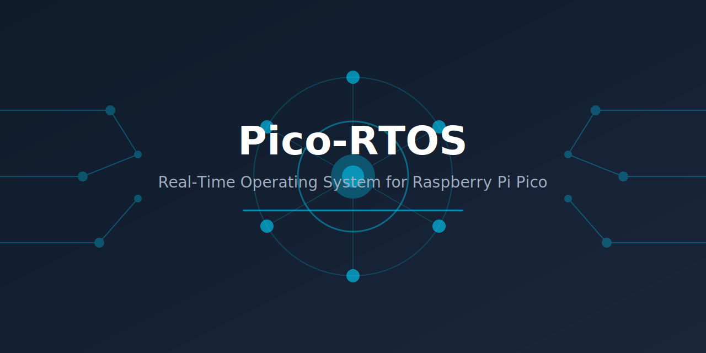

<div align="center">

# Pico-RTOS


[](https://github.com/muditbhargava66/pico-rtos/graphs/contributors)
[](https://github.com/muditbhargava66/pico-rtos/commits/main)
[](https://github.com/muditbhargava66/pico-rtos/releases)
[](https://github.com/muditbhargava66/pico-rtos/issues)
[](https://github.com/muditbhargava66/pico-rtos/pulls)
[](https://github.com/muditbhargava66/pico-rtos/stargazers)
[](https://github.com/muditbhargava66/pico-rtos/network/members)

**A production-ready, lightweight real-time operating system for the Raspberry Pi Pico (RP2040). Pico-RTOS provides advanced synchronization primitives, multi-core SMP support, comprehensive debugging tools, and enterprise-grade reliability features. Built for embedded systems requiring deterministic timing and robust resource management.**



</div>

---

## Features

### Task Management
- **Preemptive Scheduling**: Priority-based multitasking with configurable priorities (0-255)
- **Task Creation/Deletion**: Dynamic task lifecycle management with parameter passing
- **Task Delays and Yields**: Precise timing control with millisecond resolution
- **Stack Overflow Protection**: Dual canary detection with configurable guard regions
- **Runtime Statistics**: CPU usage, context switch counts, and stack high-water marks

### Synchronization Primitives
- **Mutexes**: Mutual exclusion with priority inheritance to prevent priority inversion
- **Semaphores**: Counting and binary semaphores with timeout support
- **Event Groups**: 32-bit event flags with wait-for-any/all semantics
- **Queues**: Thread-safe FIFO messaging with configurable item sizes
- **Stream Buffers**: Variable-length byte stream communication with zero-copy optimization

### Memory Management
- **Dynamic Allocation**: Thread-safe malloc/free with tracking and leak detection
- **Memory Pools**: Fixed-size block allocation with O(1) deterministic timing
- **Memory Protection Unit (MPU)**: Hardware-assisted access control and stack protection
- **Usage Analytics**: Real-time monitoring of heap fragmentation and allocation patterns

### Multi-Core Support (SMP)
- **Dual-Core Scheduling**: True symmetric multi-processing on RP2040's Cortex-M0+ cores
- **Automatic Load Balancing**: Configurable workload distribution with migration thresholds
- **Core Affinity**: Pin tasks to specific cores for deterministic timing
- **Inter-Processor Communication (IPC)**: High-speed message passing between cores
- **Cross-Core Synchronization**: All primitives are thread-safe across cores

### Timing Services
- **System Tick**: Configurable tick frequency (100 Hz to 2000 Hz)
- **Software Timers**: One-shot and auto-reload timers with callback functions
- **High-Resolution Timers**: Microsecond-precision timing for critical measurements
- **Universal Timeouts**: Consistent timeout handling across all blocking operations

### Debugging and Profiling
- **Runtime Task Inspection**: Live task state, priority, and stack usage monitoring
- **Execution Profiler**: Function-level timing analysis with min/max/average statistics
- **System Tracing**: Event logging with timestamps for post-mortem analysis
- **Debug Logging**: Multi-level logging (ERROR, WARN, INFO, DEBUG) with subsystem filtering

### Quality Assurance
- **Deadlock Detection**: Automatic detection of circular wait conditions
- **Health Monitoring**: Continuous tracking of CPU, memory, and task metrics
- **Watchdog Integration**: Hardware watchdog support with automatic feeding
- **Alert System**: Configurable thresholds with callback notifications

### I/O and Peripherals
- **I/O Abstraction Layer**: Unified read/write interface for hardware peripherals
- **Interrupt-Safe Operations**: RTOS-aware interrupt handling with deferred processing

### Compatibility
- **Backward Compatible**: Existing v0.2.x applications compile without changes
- **Migration Support**: Deprecation warnings guide API updates
- **Configurable Build**: Enable/disable features via menuconfig or CMake

---

## Getting Started

### Prerequisites

| Requirement | Version | Notes |
|-------------|---------|-------|
| Raspberry Pi Pico | RP2040-based | Or compatible boards |
| ARM GCC Toolchain | 10.3+ | arm-none-eabi-gcc |
| CMake | 3.13+ | Build system |
| Python | 3.6+ | Configuration tools |
| Pico SDK | 1.5.0+ | Automatically fetched |

### 1. Clone the Repository

```bash
git clone https://github.com/muditbhargava66/pico-rtos.git
cd pico-rtos
```

### 2. Set Up the Pico SDK

**Option A: Automated Setup (Recommended)**

```bash
chmod +x setup-pico-sdk.sh
./setup-pico-sdk.sh
```

**Option B: Manual Submodule Setup**

```bash
git submodule add -f -b master https://github.com/raspberrypi/pico-sdk.git extern/pico-sdk
git submodule update --init --recursive
cp extern/pico-sdk/external/pico_sdk_import.cmake .
```

**Option C: Use Existing SDK**

```bash
export PICO_SDK_PATH=/path/to/your/pico-sdk   # Linux/macOS
set PICO_SDK_PATH=C:\path\to\your\pico-sdk    # Windows
```

### 3. Configure and Build

**Interactive Configuration (Recommended)**

```bash
pip install -r requirements.txt
make menuconfig    # Terminal-based configuration
make build
```

**Traditional CMake Build**

```bash
mkdir build && cd build
cmake ..
make
```

**Quick Start**

```bash
make quick-start   # Sets up SDK and builds with defaults
```

### 4. Flash to Device

1. Hold BOOTSEL button on Pico and connect USB
2. Release button (Pico mounts as USB drive `RPI-RP2`)
3. Copy the `.uf2` file:

```bash
cp build/examples/led_blinking/led_blinking.uf2 /Volumes/RPI-RP2/   # macOS
cp build/examples/led_blinking/led_blinking.uf2 /media/$USER/RPI-RP2/  # Linux
```

---

## Usage Examples

### Creating Tasks

```c
#include "pico_rtos.h"

void my_task(void *param) {
    while (1) {
        // Task work
        pico_rtos_task_delay(100);  // 100ms delay
    }
}

int main(void) {
    pico_rtos_init();
    
    pico_rtos_task_t task;
    pico_rtos_task_create(&task, "MyTask", my_task, NULL, 512, 5);
    
    pico_rtos_start();  // Does not return
    return 0;
}
```

### Mutex-Protected Shared Resource

```c
pico_rtos_mutex_t mutex;

void init(void) {
    pico_rtos_mutex_init(&mutex);
}

void critical_section(void) {
    if (pico_rtos_mutex_lock(&mutex, 1000)) {  // 1s timeout
        // Access shared resource
        pico_rtos_mutex_unlock(&mutex);
    }
}
```

### Queue-Based Communication

```c
pico_rtos_queue_t queue;
uint8_t buffer[10 * sizeof(int)];

void init(void) {
    pico_rtos_queue_init(&queue, buffer, sizeof(int), 10);
}

void producer(void) {
    int data = 42;
    pico_rtos_queue_send(&queue, &data, PICO_RTOS_WAIT_FOREVER);
}

void consumer(void) {
    int data;
    if (pico_rtos_queue_receive(&queue, &data, 100)) {
        // Process data
    }
}
```

### Timer Callback

```c
void on_timer(void *param) {
    // Timer expired
}

void setup_timer(void) {
    pico_rtos_timer_t timer;
    pico_rtos_timer_init(&timer, "Timer", on_timer, NULL, 1000, true);
    pico_rtos_timer_start(&timer);
}
```

---

## Examples

The `examples/` directory contains 11 complete applications:

| Example | Description |
|---------|-------------|
| `led_blinking` | Basic task management and GPIO control |
| `task_synchronization` | Mutex and semaphore usage patterns |
| `task_communication` | Queue-based producer-consumer |
| `hardware_interrupt` | RTOS-aware interrupt handling |
| `event_group_coordination` | Multi-task synchronization with event flags |
| `stream_buffer_data_streaming` | High-throughput data streaming |
| `multicore_load_balancing` | SMP scheduling demonstration |
| `performance_benchmark` | Context switch and latency measurement |
| `power_management` | Low-power mode integration |
| `system_test` | Comprehensive RTOS validation |
| `debugging_profiling_analysis` | Runtime monitoring tools |

```bash
make examples                          # Build all
make led_blinking                      # Build specific
cp build/examples/led_blinking/led_blinking.uf2 /Volumes/RPI-RP2/
```

---

## Documentation

| Document | Description |
|----------|-------------|
| [Getting Started](docs/getting_started.md) | Installation and first project |
| [User Guide](docs/user_guide.md) | Comprehensive RTOS concepts |
| [API Reference](docs/api_reference.md) | Complete function documentation |
| [Multi-Core Guide](docs/multicore.md) | SMP programming details |
| [Performance Guide](docs/performance_guide.md) | Optimization techniques |
| [Troubleshooting](docs/troubleshooting.md) | Common issues and solutions |
| [Contributing](docs/contributing.md) | Development guidelines |

---

## Project Structure

```
pico-rtos/
├── assets/                     # Images and media
│   └── banner.svg             # Repository banner
├── include/                    # Public headers
│   ├── pico_rtos.h            # Main include file
│   └── pico_rtos/             # Component headers (28 files)
│       ├── task.h             # Task management
│       ├── mutex.h            # Mutexes
│       ├── semaphore.h        # Semaphores
│       ├── queue.h            # Queues
│       ├── event_group.h      # Event groups
│       ├── stream_buffer.h    # Stream buffers
│       ├── memory_pool.h      # Memory pools
│       ├── smp.h              # Multi-core support
│       ├── timer.h            # Software timers
│       ├── hires_timer.h      # High-resolution timers
│       ├── profiler.h         # Execution profiling
│       ├── trace.h            # System tracing
│       ├── debug.h            # Debug utilities
│       ├── health.h           # Health monitoring
│       ├── watchdog.h         # Watchdog integration
│       ├── alerts.h           # Alert system
│       ├── deadlock.h         # Deadlock detection
│       ├── mpu.h              # Memory protection
│       ├── io.h               # I/O abstraction
│       ├── logging.h          # Debug logging
│       ├── timeout.h          # Universal timeouts
│       ├── error.h            # Error codes
│       └── config.h           # Configuration
├── src/                        # Implementation (27 source files)
├── examples/                   # Example applications (11 projects)
├── tests/                      # Test suite (40 test files)
├── docs/                       # Documentation (13 guides)
├── scripts/                    # Build utilities
├── cmake/                      # CMake modules
├── extern/                     # External dependencies (Pico SDK)
├── CMakeLists.txt             # Build configuration
├── Kconfig                     # Menuconfig definitions
├── Makefile                    # Convenience targets
├── CHANGELOG.md               # Version history
├── ROADMAP.md                 # Development plan
└── LICENSE                    # MIT License
```

---

## Performance

Performance characteristics are measured using the `performance_benchmark` example on actual hardware. Run the benchmark example to measure your specific configuration:

```bash
# Build and flash performance benchmark
make performance_benchmark
cp build/examples/performance_benchmark/performance_benchmark.uf2 /Volumes/RPI-RP2/
```

**Performance Targets (RP2040 @ 125 MHz):**
- Context switch: < 100 μs (typical target)
- Mutex lock/unlock: < 20 μs uncontended
- Queue send/receive: < 30 μs
- Memory pool allocation: O(1) deterministic

For detailed performance analysis and optimization guidance, see [Performance Guide](docs/performance_guide.md).

---

## Contributing

Contributions are welcome. Please see [Contributing Guidelines](docs/contributing.md) for:

- Code style and standards
- Testing requirements
- Pull request process
- Issue reporting

---

## Roadmap

See [ROADMAP.md](ROADMAP.md) for planned features and development priorities.

---

## License

Pico-RTOS is released under the [MIT License](LICENSE).

---

## Acknowledgements

Pico-RTOS was inspired by the design principles of other real-time operating systems and benefits from the excellent Pico SDK documentation provided by the Raspberry Pi Foundation.

---

<div align="center">

**Contact**: [@muditbhargava66](https://github.com/muditbhargava66) | **Issues**: [GitHub Issues](https://github.com/muditbhargava66/pico-rtos/issues)

© 2025 Mudit Bhargava. [MIT License](LICENSE)

</div>