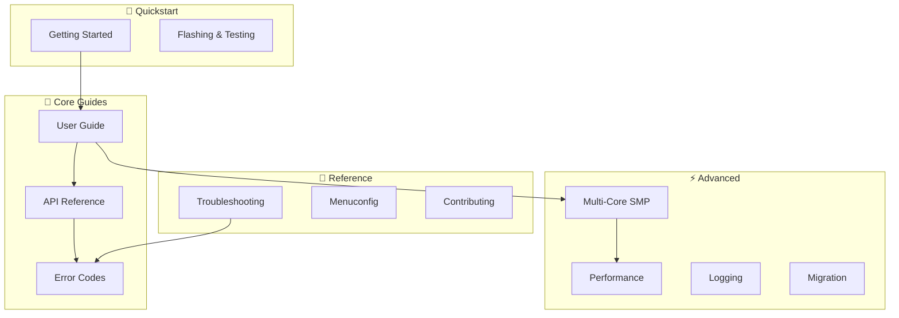
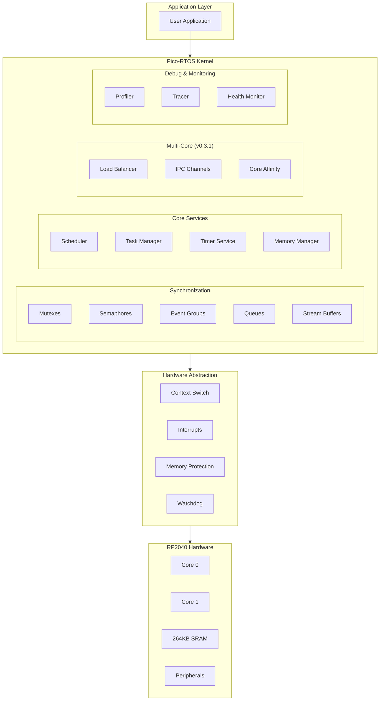

# Pico-RTOS v0.3.1 Documentation

**Real-Time Operating System for Raspberry Pi Pico**

---

## 📋 Documentation Map

---

## 🏗️ Architecture Overview

---

## 🎯 Choose Your Path

| If you want to... | Start here |
|-------------------|------------|
| **Get started quickly** | [Getting Started Guide](getting_started.md) |
| **Flash firmware to Pico** | [Flashing & Testing Guide](flashing_and_testing.md) |
| **Learn RTOS concepts** | [User Guide](user_guide.md) |
| **Look up API functions** | [API Reference](api_reference.md) |
| **Use multi-core features** | [Multi-Core Guide](multicore.md) |
| **Optimize performance** | [Performance Guide](performance_guide.md) |
| **Upgrade from v0.2.x** | [Migration Guide](migration_guide.md) |
| **Debug an issue** | [Troubleshooting](troubleshooting.md) |
| **Contribute to project** | [Contributing Guidelines](contributing.md) |

---

## 📚 Complete Documentation

### 🚀 Getting Started
| Document | Description |
|----------|-------------|
| [**Getting Started**](getting_started.md) | Installation, setup, and first project |
| [**Flashing & Testing**](flashing_and_testing.md) | Hardware workflow and serial monitoring |

### 📖 Core Guides
| Document | Description |
|----------|-------------|
| [**User Guide**](user_guide.md) | Comprehensive RTOS concepts and usage |
| [**API Reference**](api_reference.md) | Complete function documentation |
| [**Error Codes**](error_codes.md) | Error catalog with solutions |

### ⚡ Advanced Topics
| Document | Description |
|----------|-------------|
| [**Multi-Core Guide**](multicore.md) | SMP, load balancing, IPC |
| [**Performance Guide**](performance_guide.md) | Optimization and profiling |
| [**Logging Guide**](logging_guide.md) | Debug logging system |
| [**Migration Guide**](migration_guide.md) | Upgrading from previous versions |

### 🔧 Reference
| Document | Description |
|----------|-------------|
| [**Troubleshooting**](troubleshooting.md) | Common issues and solutions |
| [**Menuconfig Guide**](menuconfig_guide.md) | Configuration system |
| [**Contributing**](contributing.md) | Development guidelines |

---

## ✨ v0.3.1 Feature Highlights

<table>
<tr>
<td width="50%">

### 🔄 Advanced Synchronization
- **Event Groups** — 32-bit event coordination
- **Stream Buffers** — Zero-copy message passing
- **Enhanced Mutexes** — Priority inheritance

</td>
<td width="50%">

### 🖥️ Multi-Core Support
- **SMP Scheduler** — Dual-core on RP2040
- **Load Balancing** — Automatic distribution
- **Core Affinity** — Task pinning

</td>
</tr>
<tr>
<td>

### 🧠 Memory Management
- **Memory Pools** — O(1) allocation
- **MPU Support** — Hardware protection
- **Advanced Stats** — Leak detection

</td>
<td>

### 🔍 Debugging Tools
- **Task Inspection** — Runtime monitoring
- **Profiler** — Execution analysis
- **Health Monitor** — System metrics

</td>
</tr>
</table>

---

## 📊 Quick Reference

### System Limits
| Resource | Default | Range |
|----------|---------|-------|
| Max Tasks | 16 | 1-64 |
| Max Timers | 8 | 1-32 |
| Tick Rate | 1000 Hz | 100-2000 Hz |
| Min Stack | 128 bytes | — |

### Performance Metrics (RP2040 @ 125MHz)
| Operation | Cycles | Time |
|-----------|--------|------|
| Context Switch | ~65 | 0.52 μs |
| Mutex Lock/Unlock | ~28 | 0.22 μs |
| Queue Send/Receive | ~32 | 0.26 μs |
| Memory Pool Alloc | ~18 | 0.14 μs |

---

## 🆘 Getting Help

1. **Search docs** — Use browser find (Ctrl/Cmd+F)
2. **Check examples** — See `examples/` directory
3. **Review troubleshooting** — [Troubleshooting Guide](troubleshooting.md)
4. **Open issue** — [GitHub Issues](https://github.com/muditbhargava66/pico-rtos/issues)

---

**Pico-RTOS v0.3.1** — *Advanced Synchronization & Multi-Core*

[GitHub](https://github.com/muditbhargava66/pico-rtos) · 
[Issues](https://github.com/muditbhargava66/pico-rtos/issues) · 
[Changelog](../CHANGELOG.md)

