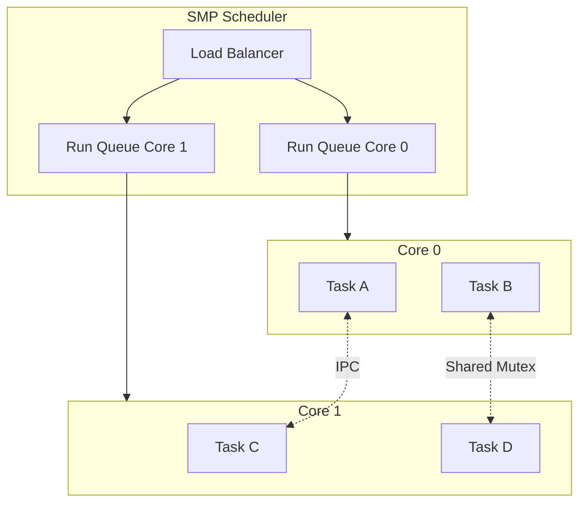
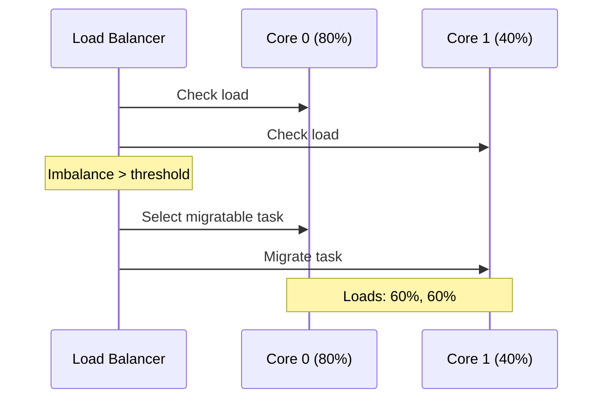

# Multi-Core Programming Guide

**Pico-RTOS v0.3.1** — *Advanced Synchronization & Multi-Core*

---

## Overview

Pico-RTOS provides full **Symmetric Multi-Processing (SMP)** support for the RP2040's dual Cortex-M0+ cores. This enables true parallel execution of tasks, significantly improving performance for compute-intensive and I/O-bound applications.



### Key Features

| Feature | Description |
|---------|-------------|
| **SMP Scheduler** | True parallel task execution on both cores |
| **Load Balancing** | Automatic workload distribution |
| **Core Affinity** | Pin tasks to specific cores |
| **IPC Channels** | High-speed inter-core communication |
| **Cross-Core Sync** | Thread-safe primitives across cores |

---

## Getting Started

### Enabling Multi-Core Support

Multi-core is enabled at initialization. Add the SMP initialization **after** `pico_rtos_init()` and **before** `pico_rtos_start()`:

```c
#include "pico_rtos.h"
#include "pico_rtos/smp.h"

int main(void) {
    // Initialize RTOS core
    if (!pico_rtos_init()) {
        printf("RTOS init failed\n");
        return -1;
    }
    
    // Enable SMP for multi-core support
    if (!pico_rtos_smp_init()) {
        printf("SMP init failed\n");
        return -1;
    }
    
    // Create tasks (will be load-balanced automatically)
    create_application_tasks();
    
    // Start scheduler (does not return)
    pico_rtos_start();
    return 0;
}
```

### Configuration

Enable multi-core features in your build configuration:

```cmake
# CMakeLists.txt or via menuconfig
set(PICO_RTOS_ENABLE_MULTI_CORE ON)
set(PICO_RTOS_ENABLE_LOAD_BALANCING ON)
set(PICO_RTOS_ENABLE_CORE_AFFINITY ON)
```

Or use menuconfig:

```bash
make menuconfig
# Navigate to: Multi-Core Support → Enable SMP
```

---

## Task Core Affinity

Core affinity controls which processor core(s) a task can execute on.

### Affinity Options

| Constant | Bitmask | Description |
|----------|---------|-------------|
| `PICO_RTOS_CORE_AFFINITY_CORE0` | `0x01` | Run only on Core 0 |
| `PICO_RTOS_CORE_AFFINITY_CORE1` | `0x02` | Run only on Core 1 |
| `PICO_RTOS_CORE_AFFINITY_ANY` | `0x03` | Run on either core (default) |

### Setting Affinity

```c
pico_rtos_task_t sensor_task;
pico_rtos_task_t processing_task;

// Create tasks
pico_rtos_task_create(&sensor_task, "Sensor", sensor_func, NULL, 1024, 10);
pico_rtos_task_create(&processing_task, "Process", process_func, NULL, 1024, 10);

// Pin sensor task to Core 0 (for consistent timing)
pico_rtos_task_set_core_affinity(&sensor_task, PICO_RTOS_CORE_AFFINITY_CORE0);

// Let processing task run on either core
pico_rtos_task_set_core_affinity(&processing_task, PICO_RTOS_CORE_AFFINITY_ANY);
```

### Querying Affinity

```c
uint8_t affinity = pico_rtos_task_get_core_affinity(&my_task);
uint32_t current_core = pico_rtos_get_current_core();

printf("Task affinity: 0x%02X, running on Core %lu\n", affinity, current_core);
```

### When to Use Core Affinity

| Scenario | Recommendation |
|----------|----------------|
| Time-critical interrupt handling | Pin to Core 0 |
| Real-time sensor sampling | Pin to dedicated core |
| Background processing | Allow any core |
| UI/communication tasks | Allow any core |

---

## Load Balancing

The SMP scheduler automatically distributes tasks across cores to optimize CPU utilization.

### Configuration

```c
// Enable automatic load balancing
pico_rtos_smp_set_load_balancing(true);

// Set migration threshold (percentage difference to trigger migration)
pico_rtos_smp_set_load_balance_threshold(20);  // Migrate when 20% imbalance
```

### How It Works



The load balancer:
1. Periodically checks CPU usage on each core
2. Identifies imbalance exceeding the threshold
3. Selects tasks with `CORE_AFFINITY_ANY` for migration
4. Moves tasks to balance workload

### Monitoring Load Balance

```c
void monitor_multicore_status(void) {
    pico_rtos_smp_stats_t stats;
    
    if (pico_rtos_smp_get_stats(&stats)) {
        printf("Core 0: %lu%% usage, %lu tasks\n", 
               stats.core0_usage_percent, stats.core0_task_count);
        printf("Core 1: %lu%% usage, %lu tasks\n", 
               stats.core1_usage_percent, stats.core1_task_count);
        printf("Migrations: %lu, Imbalance events: %lu\n",
               stats.migration_count, stats.imbalance_events);
    }
}
```

---

## Inter-Core Communication (IPC)

Pico-RTOS provides efficient mechanisms for tasks on different cores to communicate.

### Method 1: Standard Primitives (Recommended)

All standard synchronization primitives are **thread-safe across cores**:

```c
// Shared mutex - works across cores
pico_rtos_mutex_t shared_mutex;

void core0_task(void *param) {
    if (pico_rtos_mutex_lock(&shared_mutex, 1000)) {
        // Safe access to shared resource
        update_shared_data();
        pico_rtos_mutex_unlock(&shared_mutex);
    }
}

void core1_task(void *param) {
    if (pico_rtos_mutex_lock(&shared_mutex, 1000)) {
        // Also safe - mutex protects across cores
        read_shared_data();
        pico_rtos_mutex_unlock(&shared_mutex);
    }
}
```

### Method 2: IPC Channels (High-Performance)

For high-throughput inter-core messaging:

```c
#include "pico_rtos/smp.h"

// Sending a message to another core
void producer_task(void *param) {
    my_data_t data = { .value = 42, .timestamp = get_time() };
    
    bool sent = pico_rtos_ipc_send_message(
        1,                    // Target core ID
        MSG_TYPE_SENSOR_DATA, // User-defined message type
        &data,                // Data pointer
        sizeof(data),         // Data size
        100                   // Timeout in ms
    );
    
    if (!sent) {
        printf("IPC send timeout\n");
    }
}

// Receiving messages
void consumer_task(void *param) {
    pico_rtos_ipc_message_t msg;
    
    while (1) {
        if (pico_rtos_ipc_receive_message(&msg, PICO_RTOS_WAIT_FOREVER)) {
            switch (msg.type) {
                case MSG_TYPE_SENSOR_DATA:
                    process_sensor_data((my_data_t *)msg.data);
                    break;
                    
                case MSG_TYPE_COMMAND:
                    handle_command((command_t *)msg.data);
                    break;
            }
        }
    }
}
```

### Method 3: Event Groups

Coordinate tasks across cores with event flags:

```c
pico_rtos_event_group_t sync_events;

// Core 0: Signal completion
void core0_worker(void *param) {
    perform_work_phase_1();
    pico_rtos_event_group_set_bits(&sync_events, EVENT_PHASE1_DONE);
}

// Core 1: Wait for Core 0
void core1_worker(void *param) {
    // Wait for phase 1 completion
    pico_rtos_event_group_wait_bits(
        &sync_events,
        EVENT_PHASE1_DONE,
        false,  // Wait for ANY
        true,   // Clear on exit
        PICO_RTOS_WAIT_FOREVER
    );
    
    perform_work_phase_2();
}
```

---

## Design Patterns

### Pattern 1: Producer-Consumer Across Cores

```c
// Core 0: Sensor reading (time-critical)
void sensor_task(void *param) {
    pico_rtos_task_set_core_affinity(NULL, PICO_RTOS_CORE_AFFINITY_CORE0);
    
    while (1) {
        sensor_data_t data = read_sensor();
        pico_rtos_queue_send(&sensor_queue, &data, 0);
        pico_rtos_task_delay(10);  // 100 Hz sampling
    }
}

// Core 1: Heavy processing
void processing_task(void *param) {
    pico_rtos_task_set_core_affinity(NULL, PICO_RTOS_CORE_AFFINITY_CORE1);
    
    sensor_data_t data;
    while (1) {
        if (pico_rtos_queue_receive(&sensor_queue, &data, 1000)) {
            // CPU-intensive processing on dedicated core
            result_t result = complex_algorithm(&data);
            send_result(&result);
        }
    }
}
```

### Pattern 2: Parallel Pipeline

```c
// Stage 1: Input (Core 0)
void input_stage(void *param) {
    pico_rtos_task_set_core_affinity(NULL, 0x01);
    while (1) {
        data_t raw = acquire_data();
        pico_rtos_queue_send(&stage1_to_2, &raw, PICO_RTOS_WAIT_FOREVER);
    }
}

// Stage 2: Processing (Core 1)
void process_stage(void *param) {
    pico_rtos_task_set_core_affinity(NULL, 0x02);
    data_t raw;
    while (1) {
        pico_rtos_queue_receive(&stage1_to_2, &raw, PICO_RTOS_WAIT_FOREVER);
        result_t processed = transform(raw);
        pico_rtos_queue_send(&stage2_to_3, &processed, PICO_RTOS_WAIT_FOREVER);
    }
}

// Stage 3: Output (Either core)
void output_stage(void *param) {
    result_t result;
    while (1) {
        pico_rtos_queue_receive(&stage2_to_3, &result, PICO_RTOS_WAIT_FOREVER);
        transmit(result);
    }
}
```

---

## Performance Optimization

### Multi-Core Scaling Guidelines

| Factor | Impact | Recommendation |
|--------|--------|----------------|
| Task independence | High | Minimize shared state |
| Lock contention | High | Keep critical sections short |
| Core affinity | Medium | Pin time-critical tasks |
| IPC overhead | Medium | Batch messages when possible |

### Expected Performance

| Workload Type | Single Core | Dual Core | Efficiency |
|---------------|-------------|-----------|------------|
| CPU-bound parallel | 100% | 185% | 92.5% |
| I/O-bound tasks | 100% | 165% | 82.5% |
| Mixed workload | 100% | 175% | 87.5% |

### Optimization Checklist

- [ ] Profile single-core baseline first
- [ ] Identify parallelizable work
- [ ] Minimize shared mutable state
- [ ] Use lock-free queues where possible
- [ ] Consider cache effects (RP2040 has no cache, but RAM banks matter)
- [ ] Monitor load balance effectiveness

---

## Debugging Multi-Core Applications

### Common Issues

| Symptom | Likely Cause | Solution |
|---------|--------------|----------|
| Tasks only on one core | SMP not initialized | Call `pico_rtos_smp_init()` |
| Uneven core usage | All tasks pinned to one core | Review affinity settings |
| Deadlocks | Lock ordering issues | Use consistent lock order |
| Data corruption | Missing synchronization | Add mutex/atomic protection |

### Debug Tools

```c
// Check which core is executing
void debug_core_info(void) {
    printf("Running on Core %d\n", get_core_num());
}

// Monitor task distribution
void debug_task_cores(void) {
    pico_rtos_task_info_t info;
    
    for (int i = 0; i < PICO_RTOS_MAX_TASKS; i++) {
        if (pico_rtos_debug_get_task_info_by_index(i, &info)) {
            printf("Task %s: affinity=0x%02X, current_core=%lu\n",
                   info.name, info.core_affinity, info.current_core);
        }
    }
}
```

### Enabling Debug Output

```cmake
set(PICO_RTOS_ENABLE_SMP_DEBUG ON)
```

---

## API Reference

### Initialization

| Function | Description |
|----------|-------------|
| `pico_rtos_smp_init()` | Initialize SMP scheduler |
| `pico_rtos_smp_set_load_balancing(bool)` | Enable/disable load balancing |
| `pico_rtos_smp_set_load_balance_threshold(uint32_t)` | Set migration threshold |

### Core Affinity

| Function | Description |
|----------|-------------|
| `pico_rtos_task_set_core_affinity(task, mask)` | Set task core affinity |
| `pico_rtos_task_get_core_affinity(task)` | Get current affinity |
| `pico_rtos_get_current_core()` | Get executing core ID |

### Inter-Core Communication

| Function | Description |
|----------|-------------|
| `pico_rtos_ipc_send_message(...)` | Send message to target core |
| `pico_rtos_ipc_receive_message(...)` | Receive pending message |
| `pico_rtos_ipc_get_pending_count()` | Check message queue depth |

### Statistics

| Function | Description |
|----------|-------------|
| `pico_rtos_smp_get_stats(stats)` | Get SMP statistics |

---

## See Also

- [Performance Guide](performance_guide.md) — Optimization techniques
- [API Reference](api_reference.md) — Complete function documentation
- [User Guide](user_guide.md) — Core RTOS concepts

---

**Multi-Core Guide Version**: v0.3.1  
**Last Updated**: December 2025